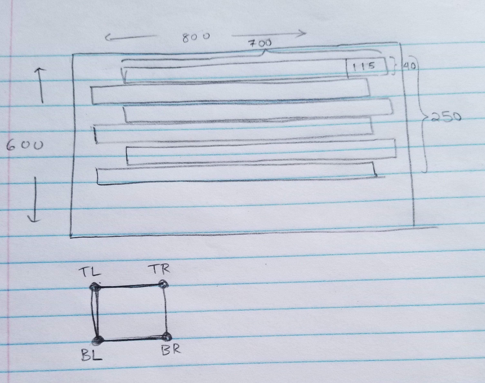

# External Documentation for Brick Breaker

## Description
Brick Breaker is a game in which the player must smash a wall of bricks by deflecting a bouncing ball with a paddle. The paddle may move horizontally and is controlled with the keys 'A' and 'D'. The player gets 3 lives to start with; a life is lost if the ball hits the bottom of the screen. When all the bricks have been destroyed, the player advances to a new, harder level. If all lives are lost, the game is over. 

## Planning Components

The image above shows my planning process in designing the window. Although not drawn to scale, I used it to approximate the length and the width for the bricks. The drawing below shows the collision behaviour. It highlights the point that will be tested, and I used these points to map out what direction the ball should move in after colliding with an object.

My UML table is attached below - 


My flowchart is attached below - 
# Placeholder

## Special Features
Special features I have added to this game are the live counter feature and the power ups feature. The live counter starts off at 3 lives, and reduces subsequently as the ball touches the bottom of the window. The power ups feature can either result in a positive power up or a negative power up. Positive power ups are identified by their green colour and they increase the width of the paddle by 15 units. Negative power ups are identified by their red colour and they decrease the width of the paddle by 15 units.

## Prerequisite Software
The pygame library will need to be installed to run this program. Run the following line - 
```commandline
python3 -m pip install -U pygame --user
```

## How to run the program
Open command prompt in CSE3130-BrickBreaker folder and run the following line to run the program on Windows. 

```commandline
py -m main
```
